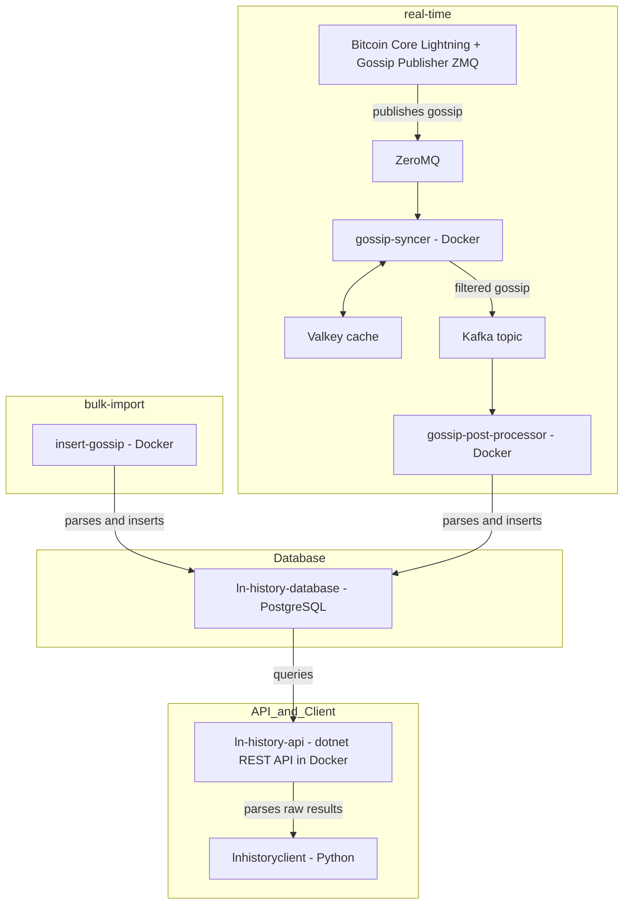

import { Badge } from '@rspress/theme-default';
import Terminal from '/src/components/Terminal';
import TerminalOneLiner from '/src/components/TerminalOneLiner.tsx';

# 👋 Introduction

Welcome to the documentation of the ln-history project. In this guide we will build the infrastructure to perisist gossip messages of the Bitcoin Lightning network.
I tried to make this setup process as simple as possible. If you struggle at some point or find an error, feel free to create an Github Issue [here](https://github.com/ln-history/.github/issues).

## Project structure

Depending on your preferences, ln-history can be used in two different _modes_

| Mode       | Description                                                            | Difficulty                             |
| -------------- | ---------------------------------------------------------------------- | -------------------------------------- |
| **[direct request](./direct_request/index.mdx)** |    _Request_ the ln-history infrastructure and parse results locally      | <Badge text="very easy" type="info" />       |
| **[bulk import](./bulk_import/index.mdx)** | _Bulk_ insert your collected gossip messages into the database _once_         | <Badge text="easy" type="tip" />       |
| **[real time](./real_time/index.mdx)**   | Insert your collected gossip messages _in real time_ into the database | <Badge text="harder" type="warning" /> |

The following diagram shows you which steps you need to fulfill to setup the infrastructure. The platform supports running **bulk-import** and **real-time** simultaneously.



The core of the plaform is a [postgres](https://www.postgresql.org/) database called _ln-history-database_ which gets setup first.
After that you can decide if you want to setup the **bulk-import** or the **real-time** (_or even both_) modes.

_I recommend the easiest mode for starters to familiarize yourself, see  **[direct_request](./direct_request/index.mdx)**,  .

The **bulk-import** mode needs the [insert-gossip](./bulk_import/index.html) [docker container](https://www.docker.com/) running which is able to read raw gossip messages, parse them and ultimatly insert them into the _ln-history-database_.

To get the **real-time** mode working you will need to setup a [Bitcoin Core Lightning](https://corelightning.org/) node with the [Gossip Publisher](./real_time/gossip-publisher-zmq.html) running. This plugin publishes collected gossip messages via a [Zero Message Queue](https://zeromq.org/) to the [gossip-syncer](./real_time/gossip-syncer.html). This micro service utilizes a [Valkey cache](https://valkey.io/) to check for duplicates and peform statistics about the collected gossip. The [gossip-syncer](./real_time/gossip-syncer.html) then continues to filter the gossip messages and publishes them to a specified topic on a [Kafka](https://kafka.apache.org/) instance which acts as an event streaming platform. The [gossip-post-processor](./real_time/gossip-post-processor) subscribes to the topic and structures the gossip messages to insert them efficiently into the _ln-history-database_

After finish one (or both) ways, you might want to setup a backend to have an exposed API that queries your database. I created the docker container [ln-history-api](./backend.html). It is a [dotnet](https://dotnet.microsoft.com/en-us/) backend featuring an authorized [REST](https://developer.mozilla.org/en-US/docs/Glossary/REST) API and with endpoints that run queries to do:

- Snapshot generation for a given timestamp
- Snapshot diff calculation for two given timestamps
- Gossip by `node_id` for a given timestamp
- Gossip by `scid` for a given timestamp

Note that the format of the results is _raw bytes_. They need to get parsed by the client.

The [lnhistoryclient](https://pypi.org/project/lnhistoryclient/) is a python package that provides classes, functions and interfaces to easly parse the gossip (in raw bytes) results into more readable formats, featuring [JSON](https://www.json.org/json-en.html) and [python networkx](https://networkx.org/).

## Architecture

Here you can see an visualization of the architecture


## I do not have any gossip messages

You can still use this tool and do it yourself.
[Dr. Christian Decker](https://scholar.google.ch/citations?user=ZaeGlZIAAAAJ&hl=de) collected and uploaded gossip messages ranging between `01-2018` to `09-2023`.
See this [repository](https://github.com/lnresearch/topology/tree/main), which provides links to his gossip messages.
You can download this data for free.

With [ln-history](ln-history.info) I provide the infrastructure to analyze the gossip messages. Maybe this is all you are looking for?

## Important notice <Badge text="warning" type="warning" />

The Lightning Network - as a second layer technology - uses the Bitcoin blockchain. It is therefore necessary to have access to the Bitcoin blockchain.

If you've set up a Bitcoin Core node with `txindex=1` enabled, you can run the [btc-rpc-explorer](https://github.com/janoside/btc-rpc-explorer) service on your bitcoin node to browse and query blockchain data via the node's RPC interface.

Currently both modes **real-time** and **bulk-import** of the platform work by requesting a _btc-rpc-explorer_. If you are trying to insert thousands of `channel_announcement` messages at once (as the current implementation of the [insert-gossip](./bulk_import/index.html) does), inserting `channel_announcement` messages take time (and bandwidth).

The **bulk-import** mode would very likely work better with the _iterate bitcoin_ setup.
I will start working on a solution to this in the near future, likely utilizing [Iterate Bitcoin](https://github.com/rustyrussell/bitcoin-iterate).

## Prerequisits

The infrastructure relies on [docker](https://docker.com) (and [docker compose](https://docs.docker.com/compose/)) trying to make it as platform independent as possible. _Nonetheless, I highly recommend running it on a Linux machine (specifically [Ubuntu](https://ubuntu.com/)), as that’s the only environment I’ve tested it on._

### Docker installation

We follow the [official documentation](https://docs.docker.com/engine/install/ubuntu/).

1. Setup up Docker's `apt` repository

2. Install the (latest) Docker packages

   <TerminalOneLiner command="sudo apt-get install docker-ce docker-ce-cli
    containerd.io docker-buildx-plugin docker-compose-plugin" />

3. Verify that the installation is successful by running the hello-world image and check if you should see this result:

<Terminal command="sudo docker run hello-world">
Hello from Docker!
This message shows that your installation appears to be working correctly.

To generate this message, Docker took the following steps:

1.  The Docker client contacted the Docker daemon.
2.  The Docker daemon pulled the "hello-world" image from the Docker Hub.
    (amd64)
3.  The Docker daemon created a new container from that image which runs the
    executable that produces the output you are currently reading.
4.  The Docker daemon streamed that output to the Docker client, which sent it
    to your terminal.

To try something more ambitious, you can run an Ubuntu container with:
$ docker run -it ubuntu bash

</Terminal>

### Docker compose installation

We follow the [official documentation](https://docs.docker.com/compose/install/standalone/)

1. We download and install the Docker Compose standalone

   <TerminalOneLiner command="curl -SL https://github.com/docker/compose/releases/download/v2.39.1/docker-compose-linux-x86_64 -o /usr/local/bin/docker-compose" />

2. We apply executable permissions to the standalone binary in the target path for the installation
   <TerminalOneLiner command="chmod +x /usr/local/bin/docker-compose" />

## Folder structure

On your machine navigate to your desired location where the project will live. You might want to create a specific user for that.

### Create user <Badge text="optional" type="tip" />

<TerminalOneLiner command="sudo adduser ln-history" />

You can then add this user to the `sudo` group if needed:

<TerminalOneLiner command="sudo usermod -aG sudo ln-history" />

Switch to the new user:

<TerminalOneLiner command="su - ln-history" />

### Folder creation

Each service in this project lives in its own isolated folder. This keeps configuration files, environment variables, and Docker setup neatly organized and modular.

The structure looks like this:

```
<service-name>/
├── .env                    # Environment variables for the service
├── docker-compose.yml      # Docker setup for this service
└── service-name.conf       # Optional configuration file
```

We will now create the project root folder **ln-history** where all the services will be created in.

<TerminalOneLiner command="mkdir ln-history && cd ln-history" />

## Ready - Set - Go

Follow the steps in the same order as the sections appear in the navbar on the left hand side.

In case you want to understand the structure and format of Lightning Network gossip messages, please check out the second last page _Gossip_.

❇️ Lets jump into the database setup!
