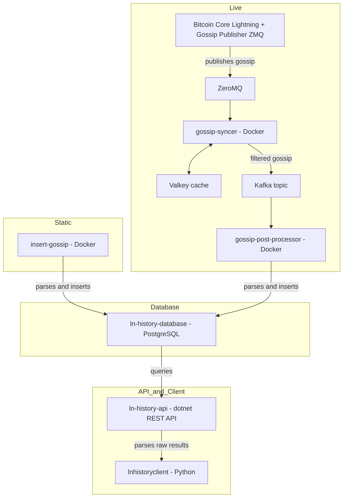

import { Badge } from '@theme';

# 👋 Introduction

Welcome to the documentation of the ln-history project. In this guide we will build the infrastructure to perisist gossip messages of the Bitcoin Lightning network.
I tried to make this setup process as simple as possible. If you struggle at some point or find an error, feel free to create an Github Issue [here](https://github.com/ln-history/.github/issues).

## Project structure

Depending on your preferences, ln-history can be used in two different _modes_

| Mode       | Description                                                            | Difficulty                             |
| ---------- | ---------------------------------------------------------------------- | -------------------------------------- |
| **static** | Insert your collected gossip messages into the database _once_         | <Badge text="easy" type="tip" />       |
| **live**   | Insert your collected gossip messages _in real time_ into the database | <Badge text="harder" type="warning" /> |

The following diagram shows you which steps you need to fulfill to setup the infrastructure. The platform supports running **static** and **live** simultaneously.

The core of the plaform is a [postgres](https://www.postgresql.org/) database called _ln-history-database_ which gets setup first.
After that you can decide if you want to setup the static or the live (_or even both_) modes.

_The simpler mode is the **static**, which I recommend for starters_

The **static** mode needs the [insert-gossip](https://github.com/ln-history/insert-gossip) [docker container](https://www.docker.com/) running which is able to read raw gossip messages, parse them and ultimatly insert them into the _ln-history-database_.

To get the **live** mode working you will need to setup a [Bitcoin Core Lightning](https://corelightning.org/) node with the [Gossip Publisher](https://github.com/ln-history/gossip-publisher-zmq) running. This plugin publishes collected gossip messages via a [Zero Message Queue](https://zeromq.org/) to the [gossip-syncer](https://github.com/gossip-syncer). This micro service utilizes a [Valkey cache](https://valkey.io/) to check for duplicates and peform statistics about the collected gossip. The [gossip-syncer](https://github.com/gossip-syncer) then continues to filter the gossip messages and publishes them to a specified topic on a [Kafka](https://kafka.apache.org/) instance which acts as an event streaming platform. The [gossip-post-processor](https://github.com/ln-history/gossip-post-processor) subscribes to the topic and structures the gossip messages to insert them efficiently into the _ln-history-database_

After finish one (or both) ways, you might want to setup a backend to have an exposed API that queries your database. I created the docker container [ln-history-api](https://github.com/ln-history/ln-history). It is a [dotnet](https://dotnet.microsoft.com/en-us/) backend featuring an authorized [REST](https://developer.mozilla.org/en-US/docs/Glossary/REST) API and with endpoints that run queries to do:

- Snapshot generation for a given timestamp
- Snapshot diff calculation for two given timestamps
- Gossip by `node_id` for a given timestamp
- Gossip by `scid` for a given timestamp
  Note that the format of the results is _raw bytes_. They need to get parsed by the client.

The [lnhistoryclient](https://pypi.org/project/lnhistoryclient/) provides classes, functions and interfaces to easly parse the gossip (in raw bytes) results into more readable formats, featuring [JSON](https://www.json.org/json-en.html) and [python networkx](https://networkx.org/).

## Architecture

Here you can see an visualization of the architecture

## <Badge text="warning" type="warning" /> Important notice

The Lightning Network - as a second layer technology - uses the Bitcoin blockchain. It is therefore necessary to have access to the Bitcoin blockchain.

If you've set up a Bitcoin Core node with `txindex=1` enabled, you can run the [btc-rpc-explorer](https://github.com/janoside/btc-rpc-explorer) service on your bitcoin node to browse and query blockchain data via the node's RPC interface.

Current both modes **live** and **static** of the platform work by requesting a _btc-rpc-explorer_. If you are trying to insert thousands of `channel_announcement` messages at once (as the current implementation of the [insert-gossip](https://github.com/ln-history/insert-gossip) does), inserting `channel_announcement` messages take time (and bandwidth).

The **static** mode would very likely work better with the _iterate bitcoin_ setup.
I will start working on a solution to this in the near future, likely utilizing [Iterate Bitcoin](https://github.com/rustyrussell/bitcoin-iterate).

## Prerequisits

The infrastructure relies on [docker](https://docker.com) (and [docker compose](https://docs.docker.com/compose/)) trying to make it as platform independent as possible. _Nonetheless, I highly recommend running it on a Linux machine, as that’s the only environment I’ve tested it on._

### Docker installation

As a first step you need to install

## Ready - Set - Go

Follow the steps in the same order as the sections appear in the navbar on the left hand side.

In case you want to understand the structure and format of Lightning Network gossip messages, please check out the second last page _Gossip_.

❇️ Lets jump into the database setup!
